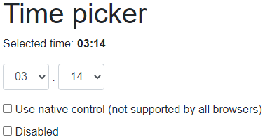
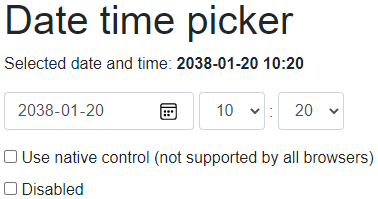

# Blazor Time Picker

This is a sample project how you could do a **time picker** in Blazor. Use it
with this single line of code:

```html
<Pekspro.Blazor.TimePicker.TimePickerComponent @bind-SecondOfDay="SecondOfDay" />
```

It could look like this:



There is also a **date time picker** control. Use it like this:

```html
<Pekspro.Blazor.TimePicker.DateTimePickerComponent @bind-DateAndTime="SelectedDateTime" />
```

And this could look like this:



The essential files are `TimePickerComponent.razor` and `DateTimePickerComponent.razor`.
Add these to you project and you should be ready to go.

## Native controls

The components are using drop down lists for selecting the time. In HTML there is
support for selecting time. You could enable this with the `UseNative`
parameter. Be aware that this is just supported by a few browsers when this is
written (May 2021) so you probably do not want to use this.
